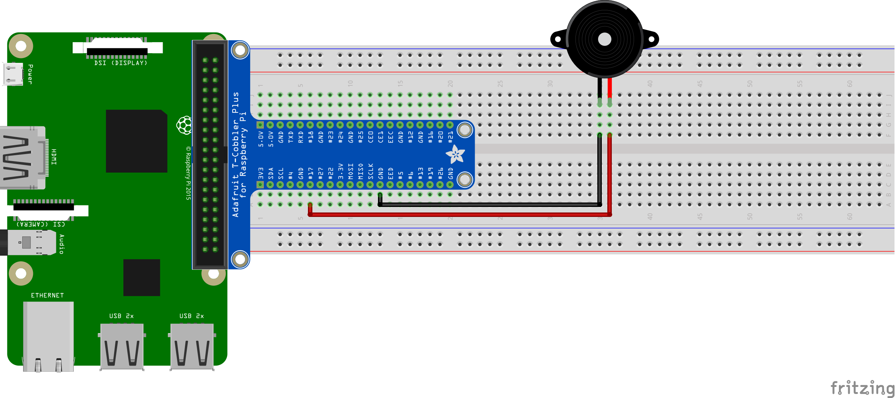

# Buzzer / Speaker
Connect and use a speaker / buzzer to emit sound.

## Contents
 - [How it works](#how-it-works)
 - [Prerequisites](#prerequisites)
 - [Wiring schema](#wiring-schema)
 - [Troubleshooting](#troubleshooting)

## How it works
The speaker is connected to a GPIO pin. To amplify the volume a transitor is added which is essentially used to increase the 3v output of the GPIO pin to 5v by interjecting the transitor connected to 5v into the loop.

The tone that is produced by the speaker is dependent on the frequency at which a high/low signal is sent to the speaker. The higher the frequency, the higher the note.

## Prerequisites
The following is required for this to function. These should already be included in the Pipfile in the root directy.
 - [RPi.GPIO](https://pypi.org/project/RPi.GPIO/)

## Wiring Schema

## Troubleshooting
_We have not yet come across any problems_
