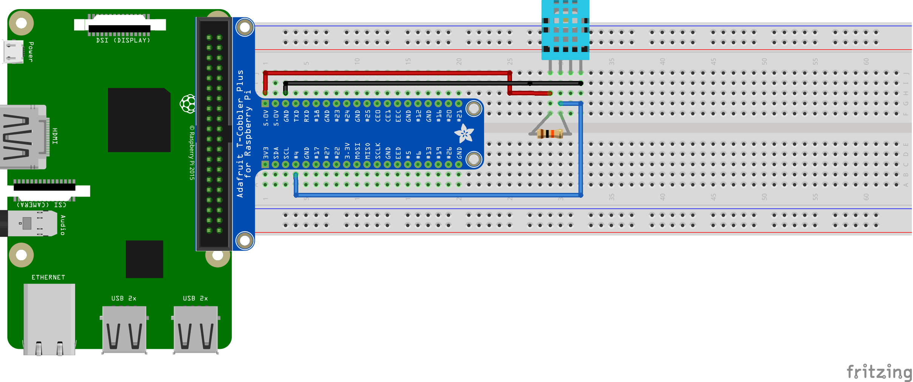

# DHT11
Test script and deps for using a DHT11 temperature and humidity sensor.

## Contents
 - [How it works](#how-it-works)
 - [Prerequisites](#prerequisites)
 - [Wiring schema](#wiring-schema)
 - [Troubleshooting](#troubleshooting)

## Prerequisites
_Still todo_

## Wiring Schema

## Troubleshooting
_Still todo_

### No erros, but text not showing up
_Still todo_
