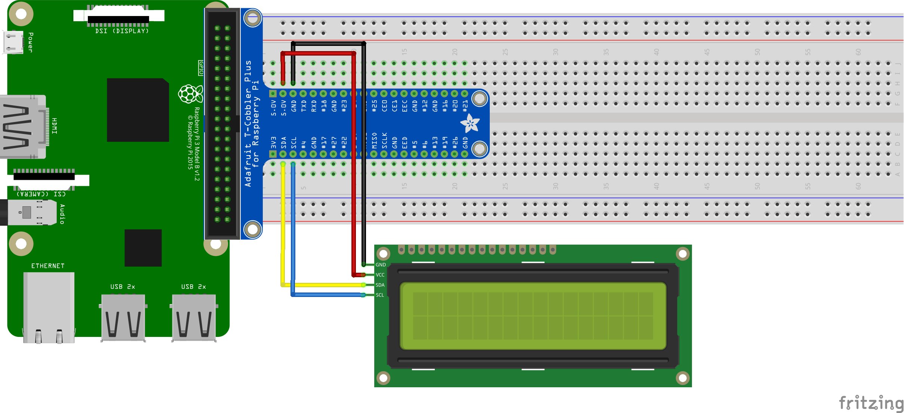

# LCD 16x2
Test script and deps for using a 16x2 LCD screen over i2c.

## Contents
 - [How it works](#how-it-works)
 - [Prerequisites](#prerequisites)
 - [Wiring schema](#wiring-schema)
 - [Troubleshooting](#troubleshooting)

## Prerequisites
The following is required to use the lcd screen. These should already be included in the Pipfile in the root directy.
 - [SMBus](https://pypi.org/project/smbus2/)

## Wiring Schema

## Troubleshooting
The driver needs to connect with the right pin. This is by default configured to `0x27`.
To detect what pin you're running on use; `i2cdetect -y 1`.

### No erros, but text not showing up
On the back of the LCD module there is a potentiometer that manages the contrast of the lcd screen. Use a small screwdriver to adjust the potentiometer and text should start showing up. You can do this while a script displaying things is running.
